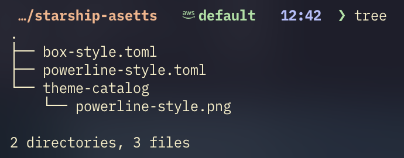
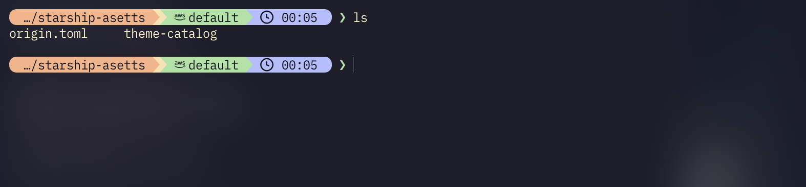

# Starship Themes Collection

Catppuccin Mocha カラーパレットを使用した Starship プロンプトのテーマコレクション

## テーマ一覧

### Box Style
シンプルでモダンなボックススタイル。角括弧で各モジュールを区切り、前景色のみを使用したミニマルなデザイン。



**特徴:**
- 背景色なしのクリーンな見た目
- 角括弧 `[ ]` で各モジュールを明確に区切り
- カラフルな前景色でモジュールを識別

**含まれるモジュール:**
- Directory (peach)
- Git branch & status (yellow)
- AWS profile (green)
- Time (lavender)
- Character (緑/赤)

---
### Powerline Style
背景色付きの右向き矢印セパレーターを使用した、クラシックなパワーラインスタイル。



**特徴:**
- 右向き矢印セパレーター (``) による視覚的な区切り
- 背景色を活用した立体的なデザイン
- 各モジュールが連続してつながる統一感

**含まれるモジュール:**
- Directory (peach background)
- Git branch & status (yellow background)
- AWS profile (green background)
- Time (lavender background)
- Character (緑/赤)

---

## インストール

### 1. リポジトリをクローン

```bash
git clone <your-repo-url> ~/.config/starship-themes
```

### 2. テーマを適用

使いたいテーマを Starship の設定ファイルにコピー：

```bash
# Box Style
cp ~/.config/starship-themes/themes/box-style.toml ~/.config/starship.toml

# または Powerline Style
cp ~/.config/starship-themes/themes/powerline-style.toml ~/.config/starship.toml
```

### 3. シェルを再起動

```bash
exec $SHELL
```

---

## 必要要件

- [Starship](https://starship.rs/) がインストールされていること
- Nerd Font がインストールされていること（アイコン表示のため）
  - 推奨: PlemolJP Console NF, JetBrains Mono Nerd Font など

---

## カスタマイズ

各テーマファイルは `~/.config/starship-themes/themes/` にあります。
自由に編集してカスタマイズできます。

### カラーパレット

すべてのテーマは Catppuccin カラーパレットを使用しています：
- Mocha (デフォルト - ダークテーマ)
- Frappe
- Latte (ライトテーマ)
- Macchiato

パレットを変更するには、設定ファイルの `palette` を編集してください：

```toml
palette = 'catppuccin_latte'  # ライトテーマに変更
```

